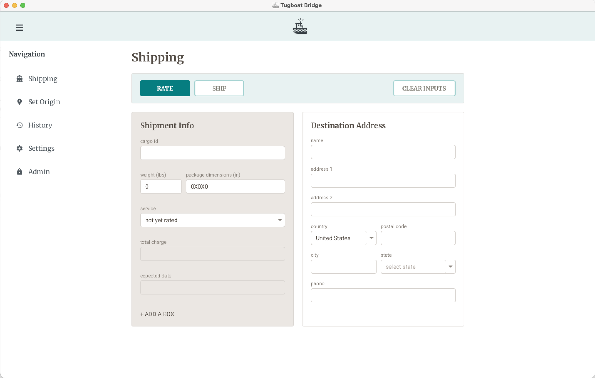
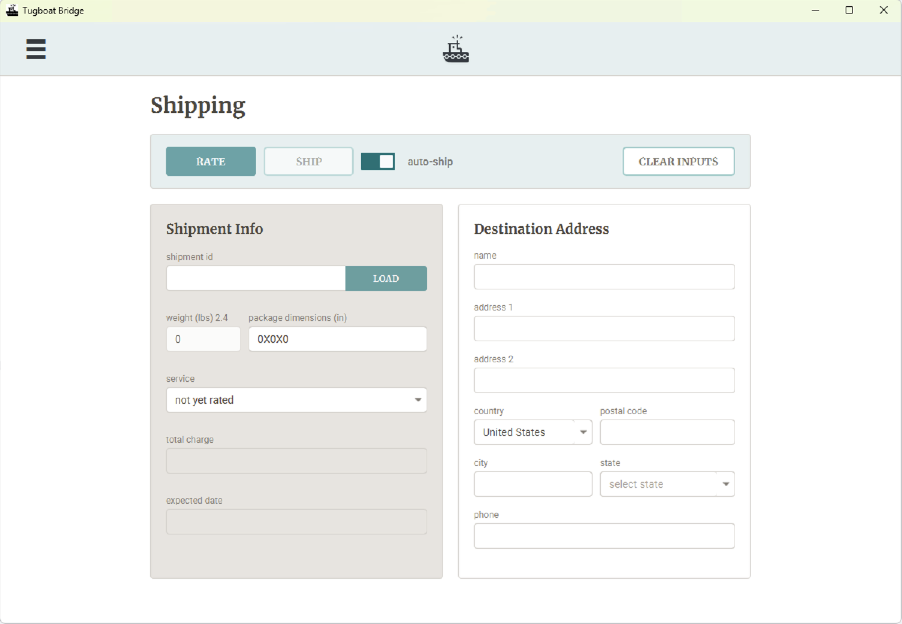

# 🚢 Tugboat Monorepo

Tugboat is software for generating shipping labels and managing carrier pick-ups. Tugboat offers delivery date shopping to ensure packages arrive on time.

It can be run as a desktop application, deployed as a web service, or used as a foundation for custom fulfillment software. It is designed to be just as useful for enterprise fulfillment as it is for someone with an inkjet printer in their apartment. Tugboat enables integration with shipping aggregator APIs with minimal configuration—providing an API key is enough to start. Deeper integrations are also supported: a Redis-compatible cache enables resumable workflows (rate now, buy later, print instantly), Hooks allow custom business logic injection, and Pickup Groups manage multiple carriers.

Tugboat runs in production at [Uncommon Goods](https://uncommongoods.com/)'s Fulfillment Center, shipping up to tens of thousands of packages per day across many carriers and multiple shipping aggregator APIs.

> Note: This project is not associated with EasyPost nor any other shipping aggregator
---

## Modules

This repo contains several Tugboat modules. The Bridge and XO are the deployable apps; the Engine, Hooks, Ports, and Adapters are building blocks.

### 1. [The Bridge](bridge/README.md) (Desktop App)

The Bridge is a cross-platform desktop shipping application built in modern JavaFX.




The Bridge is designed for an apartment, a garage, or a 100K sq ft fulfillment center—wherever shipping labels need to be generated. It can function as a simple form-based label generator requiring manual entry of addresses and parcel details. Alternatively, it integrates directly with physical scales and Zebra™ label printers, manages pick-ups, and uses Tugboat Hooks to automate order address and parcel information retrieval. This gives warehouse staff fine-grained control over rate shopping directly from their workstations. It runs on the [Tugboat Engine](#3-the-engine), which pre-buys labels so printing is instant — see below.

The Bridge is production ready on Windows. MacOS and Linux should be buildable with [JPackage](https://docs.oracle.com/en/java/javase/14/docs/specs/man/jpackage.html), but they haven't been tested. They're on the roadmap.

**Build & Run:**
```bash
./gradlew :tugboat-bridge:run
```

### 2. [XO](xo/README.md) (Web Service)
XO = Executive Officer

XO is a Micronaut-based web service built around the [Engine](engine/README.md) offering SQS queue-based async endpoints and a built-in SQS consumer.  
It's a fairly simple service provided here primarily as a reference implementation.  
Call any of the Tugboat Engine's state transitions as a RESTful web service synchronously or async.  

Import the [Postman Collection](xo/tugboat-api.postman_collection.json) and try it out.

**Code Example:**
```bash
# Tell the web service to rate a shipment asynchronously.
# The SQS consumer will pick it up and cache the results.
curl -X POST 'http://localhost:8080/tugboat/SHIP-1001/rate?async=true'

# Read what the worker cached
curl 'http://localhost:8080/tugboat/SHIP-1001'
```

**Build & Run:**
```bash
# Brings up the web service along with LocalStack (for SQS) and Redis
docker compose up --build
```
Alternatively, run it directly:
```bash
./gradlew :tugboat-xo:run
```

### 3. [The Engine](engine/README.md) (core library)

The Engine is a library that turns EasyPost-compatible APIs into a state machine, executing hooks and caching progress at each step of the shipping workflow. It's the core underneath the [Bridge](bridge/README.md) desktop app and [XO](xo/README.md), a RESTful web service. The Engine is the recommended starting point for custom integrations.

`INITIAL` -> `INITIALIZED` -> `RATED` -> `SHOPPED` -> `PURCHASED` -> `PRINTED` -> `VOIDED`  
The state machine is declarative: call any transition, and Tugboat drives the shipment to that state, running every step in between. The state machine automatically executes intermediate steps, allowing the workflow to be paused and resumed seamlessly.

When a cache is provided, Tugboat serializes its state after each transition. This allows workflows to be split across time, shifting slow external API calls ahead of the moment a packer or backend process is waiting:

- On order receipt, `initialize` is called — Hooks pull in customer data and parcel info.
- `rate` is called when ready, absorbing the latency of querying multiple carrier accounts.
- After picking, `purchase` (which inherently calls `shop`) is executed to acquire the postage.
- When the shipper finally clicks print, the label is already bought and prints instantly.

The long-running tasks are done earlier to make fulfillment run faster.

**Code Example:**
```java
// Build and drive a shipment through the state machine
Tugboat tugboat = Tugboat.builder(engineConfig, "SHIP-1001")
        .originAddress(origin)
        .destinationAddress(destination)
        .parcel(parcel)
        .expectedDeliveryDate(LocalDate.now().plusDays(4))
        .build();

// purchase() automatically initializes, rates, shops, and buys postage.
tugboat.purchase();

// Print the labels retrieved from the carrier
List<IPostageLabel> labels = tugboat.print();
labels.forEach(pl -> System.out.println(pl.getLabelFile()));
```

**Build & Run:**
```bash
./gradlew :tugboat-engine:build
./gradlew :tugboat-engine:test
```
*(Requires a Docker daemon for TestContainers during the test phase.)*

### 4. [Hooks](hooks/README.md) (Inject your business logic)

Hooks serve as the injection point for business logic into the Engine's state machine. They are simpler, more flexible, and more fine-grained than EasyPost's native hooks API.

Hooks align perfectly with the Engine's internal states. This enables looking up order addresses during the `INITIAL` state, applying custom rules to rates during the `RATED` state, or intercepting errors before they surface to a user. The Engine's behavior can be customized extensively without modifying its core code.

**Code Example:**
```java
public class MyCustomInitialHook implements TugboatHook {
    private final DSLContext jooqDsl;

    public MyCustomInitialHook(DSLContext jooqDsl) {
        this.jooqDsl = jooqDsl;
    }
    
    @Override
    public void execute(Tugboat tugboat) {
        // get address and parcel properties from a database by ID
        int orderId = Integer.parseInt(tugboat.getCargoId());
        Result<Record> destinationAddressResult = jooqDsl.selectFrom(ADDRESS)
          .join(CUST_ORDER).using(ADDRESS.ADDRESS_ID)
          .where(CUST_ORDER.ORDER_ID.eq(orderId))
          .fetch();
        // ... construct address map
        IAddress destinationAddress = new TugboatAddress(addressMap);
        tugboat.setDestinationAddress(destinationAddress);
        // ... other address and parcel operations
        if (tugboat.getRates().isEmpty()) {
            throw new RuntimeException("No rates available for this package!");
        }
    }
}
```

**Build & Run:**
```bash
./gradlew :tugboat-hooks:build
```


### 5. [Ports](ports/README.md) (A suite of interfaces)
Ports is a collection of interfaces based on [EasyPost-Java](https://github.com/EasyPost/easypost-java)'s API. These are the types used in the Engine. This allows any shipping API to be adapted into an EasyPost-compatible one. This provides complete flexibility, allowing the use of any preferred shipping aggregator API.

Tugboat is also cache agnostic and a set of [Jedis](https://github.com/redis/jedis)-compatible interfaces is provided as well.

### 6. [Adapters](adapters/README.md) (Ports implementations)
Adapters provides a set of concrete Ports implementations.

#### Shipping aggregators:
 - [EasyPost](adapters/easypost/README.md)
 - More coming soon


#### Cache:
 - [Redis](adapters/redis/README.md)

---

## ⚙️ Requirements

- **JDK 21**
- **Docker**: A Docker runtime is needed for `TestContainers` during testing and for `XO` Micronaut optimization.
- **Cache**: A cache is optional, but it's required at runtime for state to persist between calls (provided via `adapters/redis`).

---

## Maintaining the public mirror

This repository is a mirror of the `oss` branch of the maintainer's internal
repository, where Tugboat is developed alongside proprietary modules that are
never published. Changes move from that branch to this repository as `git am`
patch files, so each published commit keeps its original message and author.

**Ground rules (internal repository):**

- Only open-source content lands on `oss`. Port generic work from internal
  branches by cherry-picking or by hand, never by merging.
- Keep `oss` linear. `git format-patch` skips merge commits, so a merge on `oss`
  would silently leave its changes out of the next export.
- Every export is marked with a tag, `oss-export/<YYYY-MM-DD>`, on the last
  exported `oss` commit. The next export starts from the most recent one.

### 1. Export (internal repository)

```bash
git fetch
LAST=$(git describe --tags --abbrev=0 --match 'oss-export/*' oss)
OUT=tugboat-oss-$(date +%F).mbox
git format-patch --binary --stdout "$LAST"..oss > "$OUT"
git log --oneline "$LAST"..oss          # what the file contains
```

Before handing the file over, scan it against the private denylist: one
extended regex per line, naming internal hosts, accounts, artifact coordinates,
and proprietary module paths. It lives outside the repository so the list
itself is never published. **Any match blocks the export**: fix `oss` and
export again.

```bash
grep -n -i -E -f ~/.config/tugboat/oss-denylist "$OUT" && echo "BLOCKED" || echo "clean"
```

Then tag the export point and push the tag:

```bash
git tag oss-export/$(date +%F) oss
git push origin oss-export/$(date +%F)
```

### 2. Apply (this repository)

Commits must carry the maintainer's identity. `git am` keeps each patch's
author but sets the committer from your local config, so set it repo-locally
first:

```bash
git config user.name  "<maintainer name>"
git config user.email "<maintainer email>"

git checkout main && git pull
git am --3way --committer-date-is-author-date /path/to/tugboat-oss-<date>.mbox
./gradlew build -x test
```

### 3. Verify, then push

The mirror is exact when the two trees are identical. Compare tree hashes; they
are the same in both repositories when the content matches:

```bash
git rev-parse HEAD^{tree}        # here
git rev-parse oss^{tree}         # in the internal repository
```

If they match, `git push origin main`.

### If `git am` stops

`git am --abort` returns to where you started. The usual cause is drift, where
this repository was changed directly, or an export range that missed something.
From the internal repository, fetch this one and look at the difference:

```bash
git fetch <public-repo-url> main
git diff --stat FETCH_HEAD oss
```

Then either fix the cause and re-export, or catch up in one commit:

```bash
# internal repository
git diff --binary FETCH_HEAD oss > catchup.patch
# this repository
git apply --index catchup.patch && git commit -m "sync with oss"
```

Re-check the tree hashes afterwards. Changes made directly in this repository
(for example, merged pull requests) must be brought back to `oss` the same way
in reverse, `git format-patch` here and `git am` there, before the next export.

---

## Contributing
PRs and Issue reports are welcome

---

## Author

Tugboat (as of v3.0.0) was designed and built by **Bradley Allen**
([@bushwald](https://github.com/bushwald)).

Originally built for and running in production at
[Uncommon Goods](https://uncommongoods.com/), and open-sourced under per-module
terms: the Engine, Bridge, and XO are under the Mozilla Public License 2.0;
the hooks, ports, adapters, and the shared root build files are MIT. See
[LICENSING.md](LICENSING.md) for what that means in practice.

> <b>A note about versioning:</b> Tugboat versions 2.x.x and below were proprietary closed source versions used at Uncommon Goods 
