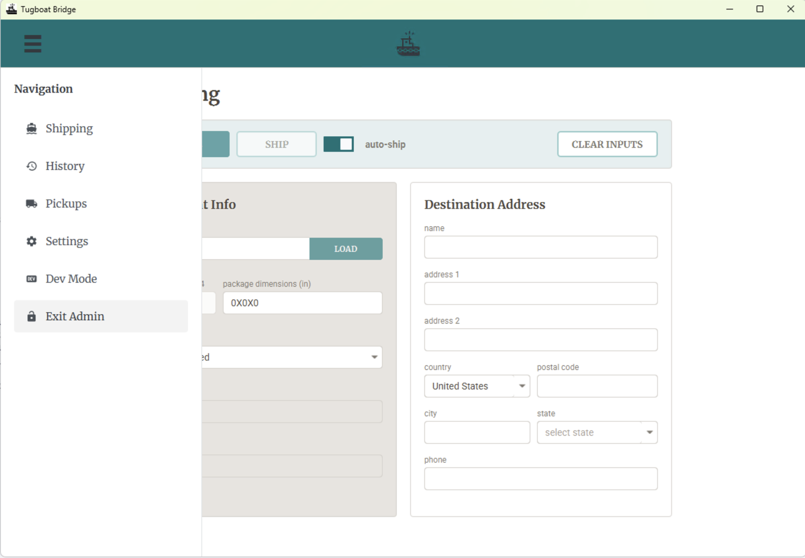
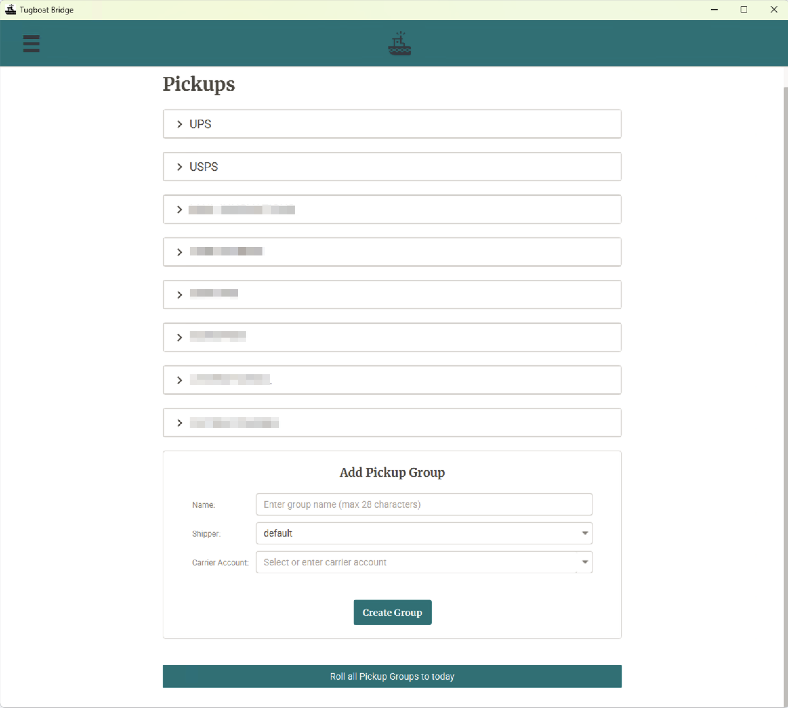
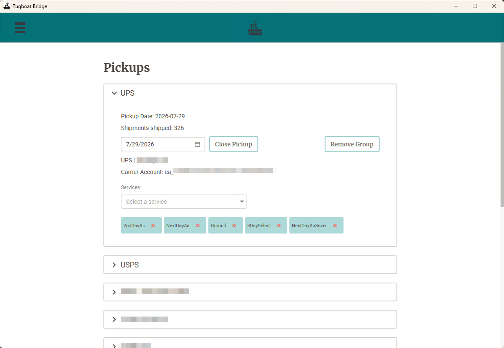
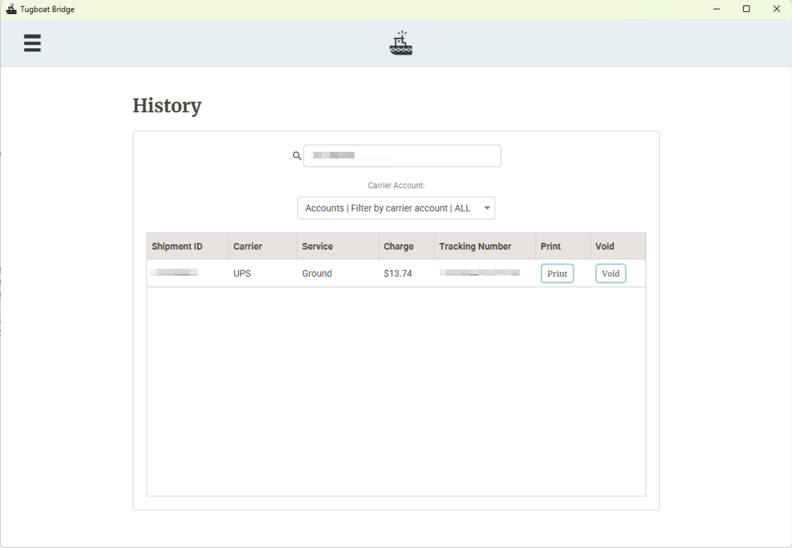

# Tugboat Bridge ⎈

The Bridge is the desktop application for Tugboat. It provides a graphical interface for weighing parcels, rating shipments, 
purchasing labels, printing, and managing daily carrier pickups.

## Platform Support

The Bridge is built on JavaFX and runs from source on Windows, macOS, and Linux. Packaged installers and hardware integrations 
are currently tested and supported only on Windows.

### Build Requirements
- **Windows MSI Generation:** Requires [WiX Toolset 3.x](https://github.com/wixtoolset/wix3/releases) to build MSI installers via [JPackage](https://docs.oracle.com/en/java/javase/14/docs/specs/man/jpackage.html).
- **Auto-Update Publishing:** Requires the [AWS CLI](https://docs.aws.amazon.com/cli/latest/userguide/getting-started-install.html) to push updates to S3.

| Feature | Windows | macOS / Linux |
|---|---|---|
| `./gradlew :tugboat-bridge:run` | Supported | Supported |
| Packaged installer (MSI) | Supported | Planned |
| In-app auto-update | Supported | Planned |

*Note: `:tugboat-bridge:jpackageMsi` will fail immediately on non-Windows platforms. Packaged macOS and Linux builds are 
on the roadmap; in the meantime, run the application from source via Gradle.*

## Interface Overview

| Screen | Purpose |
|---|---|
| **Shipping** | The primary workflow. Enter or scan a cargo ID, capture weight and dimensions, fetch rates, purchase, and print. |
| **Pickups** | Manage facility configuration, define pickup groups with accepted services, and close groups for manifest generation upon truck departure. |
| **Settings** | Configure hardware devices (scale port, printer), carrier clients, the cache client, and custom properties for hooks. |
| **History** | View recently shipped parcels for the current session, with support for reprint and void operations. |

<br/>
<br/>
<br/>
<br/>
The dark green header bar indicates Admin Mode is active (i.e., Pickups page and dev mode is accessible)

## Hardware Integration

- **Scale**: Reads over a serial port. Port selection is available on the Settings page. `ScaleService` supports continuous monitoring, single weigh, and zeroing operations.
- **Printer**: Integrates with any printer accessible to the system. Choose between ZPL and conventional label printers on the Settings page.
- 

## Configuration

Configuration is managed directly through the UI on the **Settings** page and is persisted locally in encrypted Java `Preferences` 
(under `tugboat.data.{env}.`). The application doesn't require configuration files or environment variables.

Settings are scoped by environment (PROD or DEV). Toggling the environment in the UI instantly republishes the settings 
and dynamically rebuilds the engine configuration.

### Data Configuration

- **Clients**: Define shipping clients. Each requires a provider key (e.g., `default`, `esw`), a type selected from discovered adapters on the classpath, and adapter-specific configuration fields. Both the available types and required fields are discovered dynamically via `ServiceLoader`. Refer to [`adapters/README.md`](../adapters/README.md).
- **Settings**: Freeform key/value pairs. Fields for the active cache client (e.g., `Cache URL`, `Cache Port`) are rendered as fixed rows. Custom rows can be added to provide runtime configuration for hooks.

Custom properties are resolvable by name in hook implementations:

```java
// Resolves a row named MY_SERVICE_URL defined in the Settings page:
String url = TugboatSettings.get("MY_SERVICE_URL");
```

This configuration strategy is compatible with [XO](../xo/README.md), where identical names are resolved as environment variables instead. See [`ports/README.md`](../ports/README.md) for full resolution rules.

## Pickups

The Pickups screen serves as the UI for the facility model described in [`engine/README.md`](../engine/README.md). It 
allows configuring a facility address and defining pickup groups for each carrier (including name, billing account, 
departure date, and accepted services). The list of accepted services populates automatically based on prior rating operations.

Closing a group finalizes its manifest batch and initializes a new one for the next pickup.

*Requirement: This screen depends on a configured cache client. Without a cache, the application remains functional for 
rating, purchasing, and printing, but pickups, manifests, and cross-process state will be unavailable.*

## Build and Execution

```bash
# Run from source (any platform)
./gradlew :tugboat-bridge:run

# Compile and test
./gradlew :tugboat-bridge:build
```

Executing `run` initializes the preloader and enables debug logging for `com.uncommongoods.tugboat`.

### Packaging (Windows Only)

*Requires [WiX Toolset 3.x](https://wixtoolset.org/) on the system `PATH`.*

```bash
gradlew :tugboat-bridge:jpackageMsi
```

This generates `bridge/build/dist/TugboatBridge-<version>.msi` for a per-user installation with a Start menu entry. 
Versioning is driven by the root `build.gradle.kts` or overridden via `-PversionOverride=x.y.z`.

**Warning**: Do not modify `upgradeUuid` in `bridge/build.gradle.kts`. It defines the MSI UpgradeCode; altering it will 
cause future installers to perform side-by-side installations rather than in-place upgrades.

### Publishing Updates

```bash
gradlew :tugboat-bridge:publishVariant
gradlew :tugboat-bridge:publishVariant -PupdateChannel=bridge-test
```

This command builds the MSI, generates a `latest.json` manifest (version, SHA-256, size, release notes), and pushes both 
to `s3://<bucket>/updates/windows/<channel>/` using the AWS CLI.

Targets can be overridden via `-PupdateBucket=`, `-PupdateRegion=`, or the `TUGBOAT_UPDATE_BUCKET` environment variable. 
Release notes can be appended using `-PreleaseNotes="..."`.

### Auto-Update

Installed applications poll `{baseUrl}/windows/{channel}/latest.json`. Upon detecting a new version, the client downloads 
the MSI to `~/.tugboat/updates/`, verifies its SHA-256 checksum, and delegates to a detached installer process to apply the update and relaunch.

**Development Properties:**

| Property | Effect |
|---|---|
| `-Dtugboat.update.disabled=true` | Disables update polling. |
| `-Dtugboat.update.channel=bridge-test` | Overrides the target polling channel. |
| `-Dtugboat.update.baseUrl=...` | Overrides the target host. |
| `-Dtugboat.update.intervalHours=1` | Overrides the polling interval. |
| `-Dtugboat.update.devSimulate=true` <br>with `-Dtugboat.update.currentVersion=0.0.1` | Simulates check/download/verify without executing the installer. |

## Adding a Carrier

Refer to [`adapters/README.md`](../adapters/README.md) for instructions on integrating custom carriers without modifying host application source code. Note that because the packaged MSI bakes in the classpath, introducing a new adapter requires rebuilding the installer.

## Passwords
The Settings page and the Admin modal have default passwords which can be found in `SignInController.java`.
These can be reset on the Settings page.  The passwords are encrypted using Java Prefs on an installed client.
Obviously, hard-coded cleartext default passwords less than ideal, and a more robust solution is on the roadmap.  

## Licensing

The Bridge application is licensed under the Mozilla Public License 2.0 (`LICENSE`). Modifications to these files distributed as a product must be published. However, adapters and hooks linked into the application remain private, and executing a modified copy internally triggers no publication requirements. For details, refer to [`LICENSING.md`](../LICENSING.md).
